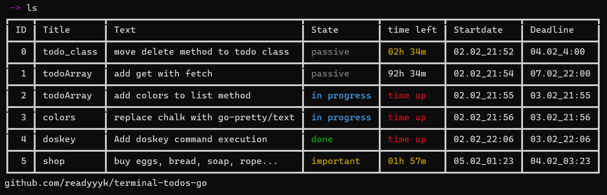

# Golang - CLI todos app


# Installation

### Downloading binary from releases
1. download latest binary from releases
2. to make tokens accessible from anywhere type:
```bash
$ # rename executable you downloaded to "todos"
$ mv todos-linux-amd64 todos # example
$ chmod 777 todos
$ echo -e "\nPATH+=\"$(pwd)\"\n" >> ~/.bashrc
```

### Custom make
```bash
git clone https://github.com/readyyyk/terminal-todos-go
```
```bash
cd terminal-todos-go
```
```bash
make
```
```bash
make install
```


| command    | arguments                     | description                                                              |
|------------|-------------------------------|--------------------------------------------------------------------------|
| exit       |                               |                                                                          |
| help       |                               | prints help                                                              |
| colors     |                               | toggle enable or disable color usage                                     |
| autosort   |                               | toggle enable or disable automatic sorting with field in last `sort`     |
| autoclear  |                               | toggle enable or disable automatic clearing screen                       |
| ls // list |                               | list all stored todos                                                    |
| clear      |                               | deletes all todos with State `done`                                      |
| sort       | {Field}                       | sorts todos array with the `Field`                                       |
| add        | {Title} {Text} {Deadline} (t) | adds new todo, in case you enter duration {\_}h{\_}m type "t" in the end |
| delete     | {ID\_1 ID\_2 ID\_3...}        | deletes all todos with written ids                                       |
| edit       | {ID} {Field} {Value}          | edits todo                                                               |

_datetime format is: dd.MM_hh:mm (d - day, M - month, h - hour, m - minute)_

_duration format is: {\_}h{\_}m (for example 12h30m, or 1h1m, but not 1d12h)_

_for lines with spaces use "" for exmaple "buy bread, milk, smth else"_

### Coming soon
- Saving data on virtual server.
- Default CLI usage
