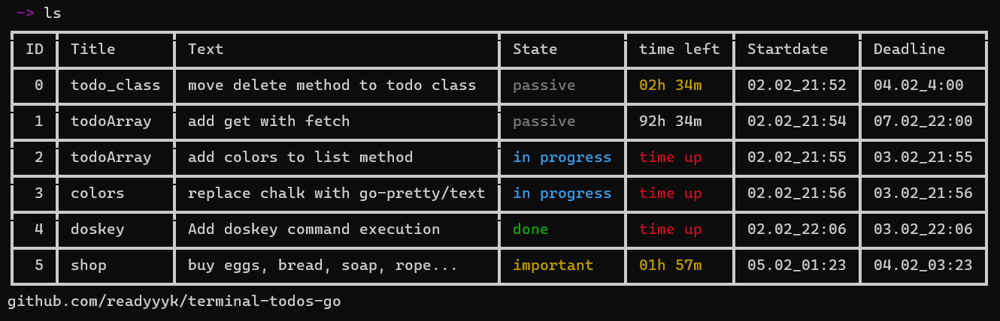

# Golang project - terminal todos app

## Temporary project that will be divided into API and Terminal app

Now to start using app u should start ***main.exe*** from app directory and type `command` to set command `todos` that can be executed anywhere from console that will start the app.

| command    | arguments                     | description                                                              |
|------------|-------------------------------|--------------------------------------------------------------------------|
| exit       |                               |                                                                          |
| help       |                               | prints help                                                              |
| cls        |                               | clears console                                                           |
| command    |                               | program can be executed from any directory using `todos`                 |
| colors     | 1 / 0 / enable / disable      | using to enable or disable color usage in program                        |
| ls // list |                               | list all stored todos                                                    |
| clear      |                               | deletes all todos with State `done`                                      |
| sort       | {Field}                       | sorts todos array with the `Field`                                       |
| add        | {Title} {Text} {Deadline} (t) | adds new todo, in case you enter duration {\_}h{\_}m type "t" in the end |
| delete     | {ID\_1 ID\_2 ID\_3...}        | deletes all todos with written ids                                       |
| edit       | {ID} {Field} {Value}          | edits todo                                                               |

_datetime format is: dd.MM_hh:mm (d - day, M - month, h - hour, m - minute)_

_duration format is: {\_}h{\_}m (for example 12h30m, or 1h1m, but not 1d12h)_

> Command `command` complete for Linux

> Calling command `command` on windows causes program sleeping, you should stop program with `Ctrl + C`, but `todos` is set.

[//]: # (> Crashing with command `command` solved)
### Coming soon
- Saving data on virtual server.
- Customisation (such as colors, log prefixes, and other)
- Add command `todos` to path (done with doskey command)

### Examples

